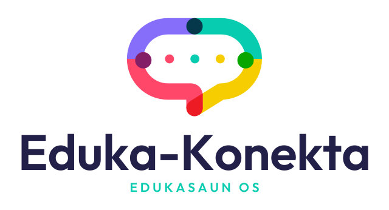
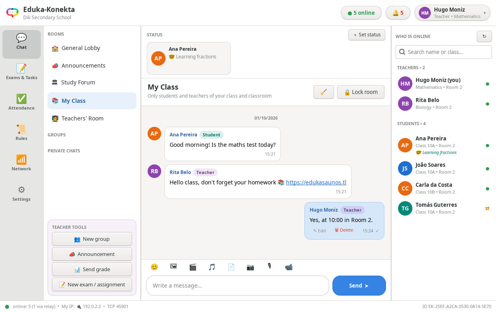
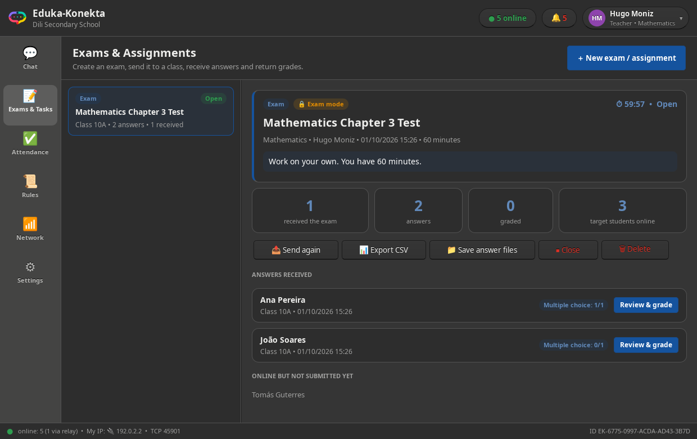
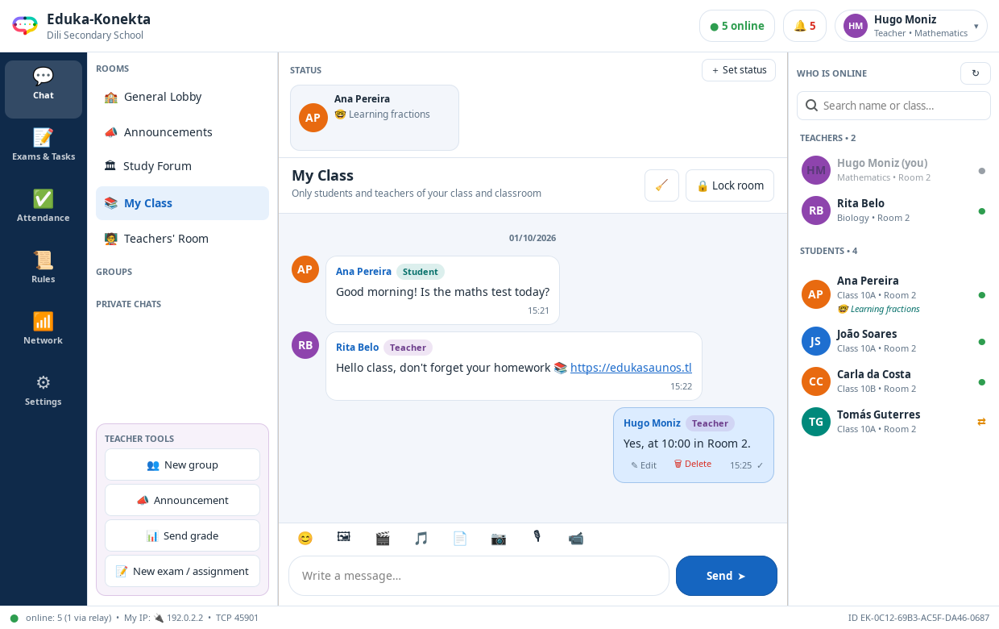
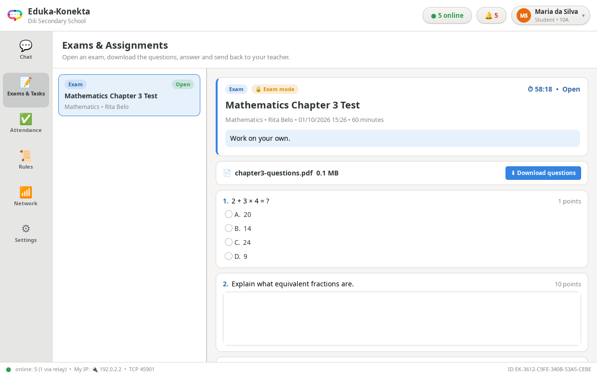

<p align="center"></p>

# Eduka-Konekta 0.1.1 Alpha

Eduka-Konekta is a lightweight GTK school application for **chat, exams, assignments and attendance**. Computers talk to each other directly over the school network — Wi-Fi, LAN cable, or both mixed — without internet, cloud accounts or a central server. Peers are accepted only when their profile uses the same school name.

The interface is available in **Bahasa Indonesia, Tetun, Português (Portugal), Português (Brasil) and English**.



## What is new in 0.1.1

- **Official logo.** A speech bubble drawn from four connected strokes — people (the round nodes) joined in one school conversation — with the Eduka-Konekta wordmark and the Edukasaun OS tagline. Files: `assets/eduka-konekta.svg` (icon), `assets/eduka-konekta-logo.svg` and `assets/eduka-konekta-logo-light.svg` (full logo for light/dark backgrounds), PNG icons in `assets/icons/`. Regenerate with `python3 tools/make_logo.py Outfit-SemiBold.ttf` (Outfit, SIL Open Font License).
- **Follows the Edukasaun OS desktop theme.** *Settings → Appearance*: **System theme** (default) takes every colour from the active GTK theme, including dark themes, and leaves buttons, entries and menus to the theme; **Eduka light** and **Eduka dark** are built-in styles. The system font is used.
- **Fixes:** closing an attendance session now reaches students; malformed school events from another computer are ignored instead of raising errors; remembered addresses are written only for newly found users; logging out resets the open page; the status bar refreshes when the Wi-Fi address changes; stored file names are in English; English is the fallback language; GObject version warnings removed.
- **Package:** hicolor PNG icons (16–512 px), `md5sums`, `Installed-Size`, and firewall setup that also works inside a Cubic chroot.

| System theme (dark) | Eduka light | Student exam |
| --- | --- | --- |
|  |  |  |

## What was new in 0.1.0

### Wi-Fi connection fix

In 0.0.6 two computers on the same network found each other over a LAN cable but often not over Wi-Fi. The causes and fixes:

| Cause on Wi-Fi | Fix in 0.1.0 |
| --- | --- |
| The subnet probe waited only 0.22 s per address. Wi-Fi (power saving, ARP resolution) is often slower, so every probe failed. | Non-blocking TCP sweep with a 1.5 s timeout, own /24 first, then neighbouring /24 blocks up to 1024 hosts on large Wi-Fi networks (/22, /16). |
| Interfaces were read only once at start-up. Wi-Fi usually connects *after* login or changes address (DHCP, roaming), so it was never announced or joined for multicast. | Interfaces are re-read every 12 s; new Wi-Fi addresses immediately join multicast and trigger a full scan. |
| Many access points drop multicast/broadcast. | Unicast UDP announcements to neighbour-table, remembered and gossiped addresses, plus a direct `discover_reply`, so one working direction is enough. |
| Dead Wi-Fi links (sleep, roaming) stayed "online" forever and blocked reconnection. | Signed heartbeat every 10 s, TCP keep-alive, and a 45 s timeout close dead links so the peer is rediscovered. |
| "AP / client isolation" blocks Wi-Fi devices from reaching each other. | **Automatic relay**: any computer both sides can reach (for example the teacher's computer on a LAN cable) relays presence, private messages, room messages and school events. Signatures stay end-to-end, so a relay cannot forge messages. |
| Linux firewalls often put Wi-Fi in a stricter zone than Ethernet. | The package installs a firewalld service and a ufw profile and opens TCP 45901 / UDP 45900 when a firewall is active. |
| Slow peers could block sending to everyone. | Each connection has its own writer queue; room messages are relayed only to peers that the sender cannot reach directly (no duplicate floods on full Wi-Fi meshes). |

The **Network** page shows each interface (📶 Wi-Fi / 🔌 LAN), direct and relayed users, remembered addresses and step-by-step troubleshooting.

### School features

- **Exams & assignments** — the teacher writes multiple-choice and essay questions and/or attaches a question file (PDF, Word, image…), chooses a class, all students or selected students, a time limit and rules, then publishes. Students download the question file, answer, attach an answer file and send it back. Multiple choice is graded automatically (the answer key never leaves the teacher's computer). The teacher reviews each answer, gives a final score and feedback and returns the result. Results export to CSV; all answer files can be saved to a folder.
- **Store and forward** — students who were offline receive the exam as soon as they connect; answers are re-sent until the teacher confirms receipt. Late answers are marked.
- **Exam mode** — optional: while an exam runs, students can only message teachers privately and messages from other students are hidden.
- **Attendance** — the teacher starts a roll call for a class, students press *I am present*, the teacher sees who is present or missing and exports CSV.
- **School rules** — default usage rules must be accepted at sign-in; teachers can publish the school's own rules to every computer.
- **Room lock** — teachers can lock a room so students can only read.
- **Word filter and anti-spam** — offensive words are masked (extra words configurable), at most 6 messages per 10 seconds.
- **Redesigned interface** — navigation rail (Chat, Exams & Tasks, Attendance, Rules, Network, Settings), room descriptions, unread counters, people search, initials avatars, in-app toast notifications, large-text option and a settings page.

Existing features remain: class/school/teacher/group/private chat, announcements, private grades, photos/voice/video/documents (with 30-minute edit, replace and delete), status feed, webcam and microphone capture, desktop notifications.

## Rooms

| Room | Who can write | Purpose |
| --- | --- | --- |
| General Lobby | everyone | friendly chat |
| Announcements | teachers | official announcements (notified to everyone) |
| Study Forum | everyone | lesson questions across classes |
| My Class | same class and classroom | class chat |
| Teachers' Room | teachers | staff only |
| Groups | members | created by teachers |
| Private chats | the two people | click a name in *Who is online* |

## Data and privacy

- Chat messages, status, groups and received chat files are **session-only** and are erased when the application closes.
- Exams, answers, grades, attendance, school rules and room locks are **kept** in `~/.local/share/eduka-konekta/records/` so a teacher never loses a class's answers. The folder can be opened from *Settings*.
- The profile stays signed in until *Log out*. The persistent `EK-...` Ed25519 device key signs every message; it proves continuity of the device, not a person's legal identity.
- Messages are signed but **not end-to-end encrypted**. When a relay is used, the relay computer can read the messages it forwards. Use Eduka-Konekta only on a trusted school network.

## Network requirements

- TCP **45901** (connections) and UDP **45900** (discovery, multicast group 239.192.45.90).
- All computers must use the same school name.
- Guest Wi-Fi networks usually block device-to-device traffic. If the router has *AP/client isolation*, either disable it or connect one computer by LAN cable so it can act as a relay. *Network → Connect IP* reaches any routed address and remembers it.

## Install on Debian 13 / Edukasaun OS

The ready-made package is in `release/eduka-konekta_0.1.1_all.deb`.

```bash
sudo apt install ./eduka-konekta_0.1.1_all.deb
```

APT downloads the dependencies (GTK 3, Python GObject, Python Cryptography, librsvg, FFmpeg, iproute2, v4l-utils, pulseaudio-utils). Do not use `dpkg -i` alone on a new system.

### Add to an Edukasaun OS image with Cubic

1. In Cubic, open the project and go to the **Terminal** page (a root shell inside the image).
2. Copy the package into the image: drag `eduka-konekta_0.1.1_all.deb` onto the terminal window (Cubic copies it to the current folder), or use the copy button.
3. Install it:

   ```bash
   apt update
   apt install -y ./eduka-konekta_0.1.1_all.deb
   rm eduka-konekta_0.1.1_all.deb
   ```

4. Continue in Cubic to generate the ISO. Every computer installed from the image has Eduka-Konekta in the Education menu, with TCP 45901 / UDP 45900 already allowed in firewalld or ufw.

Launch *Eduka-Konekta* from the Education or Network menu, or run `eduka-konekta`.

## Build and test

```bash
sh build-deb.sh release          # writes release/eduka-konekta_<version>_all.deb
PYTHONPATH=src python3 -m unittest discover -s tests -v
```

The tests include a three-computer relay scenario that simulates Wi-Fi client isolation and a complete exam, attendance and rules flow over real sockets.

---

## Panduan singkat (Bahasa Indonesia)

**Guru**
1. Masuk sebagai *Guru*, isi nama sekolah yang sama persis dengan siswa.
2. **Ujian & Tugas → Buat ujian / tugas**: tulis soal pilihan ganda/esai dan/atau lampirkan file soal, pilih kelas dan batas waktu, lalu *Kirim ke siswa*.
3. Jawaban masuk otomatis. Klik **Periksa & nilai**, isi nilai akhir dan catatan, lalu **Kirim hasil**. Gunakan **Ekspor CSV** untuk rekap nilai.
4. **Absensi → Mulai absensi** untuk mencatat kehadiran kelas.
5. **Aturan** untuk mempublikasikan tata tertib sekolah. Tombol **Kunci ruang** di chat membuat siswa hanya bisa membaca.

**Siswa**
1. Ujian dari guru muncul di **Ujian & Tugas**. Tekan **Unduh soal** jika ada file soal.
2. Jawab soal, lampirkan file jawaban bila perlu, lalu **Kirim jawaban**. Jika guru sedang offline, jawaban terkirim otomatis nanti.
3. Saat guru memulai absensi, buka **Absensi** dan tekan **Saya hadir**.

**Jika pengguna lain tidak terlihat di Wi-Fi**: buka halaman **Jaringan**, tekan *Segarkan & cari ulang*, matikan *AP/Client Isolation* di router atau hubungkan komputer guru dengan kabel LAN (otomatis menjadi relay), atau gunakan *Hubungkan IP* dengan IP komputer guru.

## Developer

Hugo Moniz do Rego
STI – Digitalização & Mídia – MCAS & Grupo IDEA
[edukasaunos.tl](https://edukasaunos.tl)
